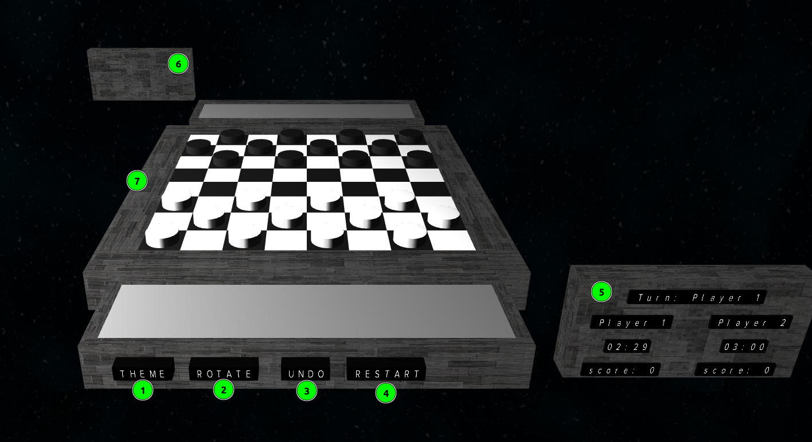

# 3D Checkers 
## FEUP M.EIC - SGI
----

### How to run
- Clone git repository
- Open the ./TP3/index.html file using the vscode Live Server extension, or a similar extension

### Project

#### Layout

When starting the project you are presented with the board integrated with the StarWars scene. The game is already set up and ready to play. This is the layout, from the perspective of player 1:

1. Theme button, that when pressed changes the surrounding theme
2. Rotate button, transitions the perspective of player 1 to the perspective of player 2, and vice-versa
3. Undo button, goes undoes the last move made, returning the gameboard to the previous state
4. Restart button, restarts the game
5. Scoreboard, which shows the current player's turn or if a player has won, the scores, and how much time each player has left
6. Opponents Scoreboard, displaying the same information as the previous scoreboard
7. The main board with two auxiliary boards for each player, where the pieces go when captured.

#### Game

The game possesses all the rules of the Checkers game. Each player can move one piece diagonally in each turn, the user is obligated to capture a piece if it is possible, if multiple captures are possible in a turn, the user can choose between doing them or not, being presented with a "next turn" button that ends the turn, when a piece reaches its respective final row it is promoted to King, represented by 2 stacked pieces, where it can do diagonal moves in all diagonal directions. The game ends when a player captures all the opponent's pieces or when a player runs out of time.

#### Game Animation Features

When a piece is played, it slides to the respective tile chosen and a spotlight continuously shines on the piece while the movement is occurring. Capture pieces do an arch to the respective auxiliary board position. Rotating the camera transitions the camera instead of instantaneously changing it.

### Group Members - T5G09

| Name             | Number    | E-Mail             |
| ---------------- | --------- | ------------------ |
| Sérgio Estêvão         | 201905680 | up201905680@up.pt             |
| Tomás Fidalgo         | 201906743 | up201906743@up.pt               |
