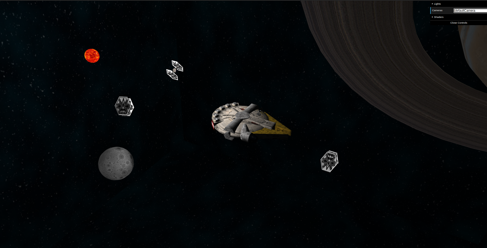
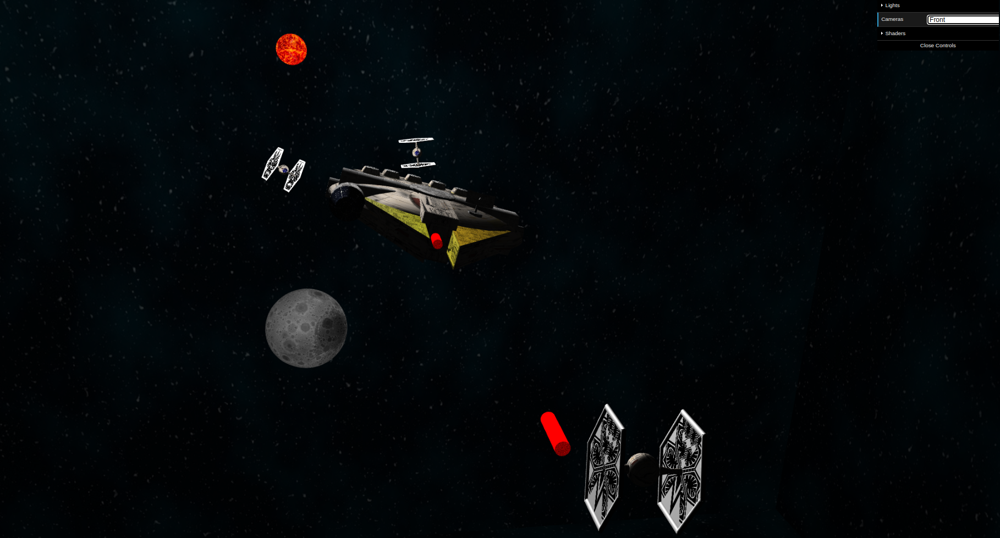
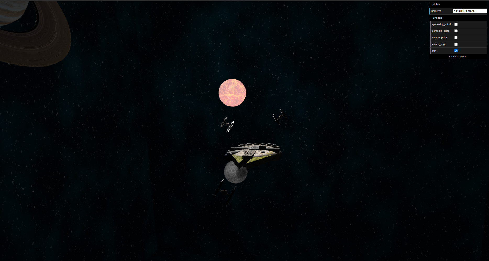
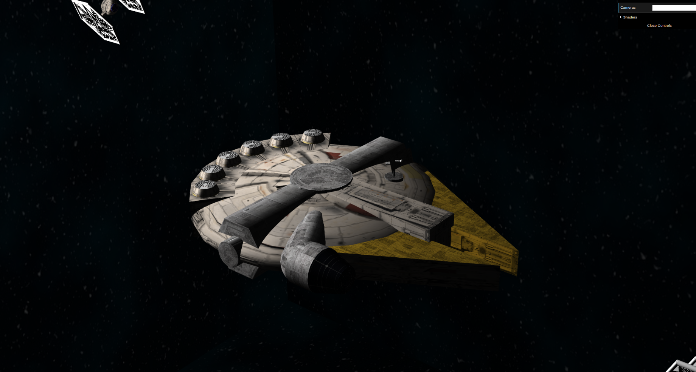

# SGI 2022/2023 - TP2

## Group: T5G09

| Name             | Number    | E-Mail             |
| ---------------- | --------- | ------------------ |
| Sérgio Estêvão         | 201905680 | up201905680@up.pt             |
| Tomás Fidalgo         | 201906743 | up201906743@up.pt               |
----
## Images

| Complete View           | Chasing Tie Fighter cinematic view     |
| ---------------- | --------- |
|         |  |

| Sun with the shader activated simulating a supernova   |   Millenium Falcon with Nurb Surfaces   |
| ---------------- | --------- |
| | |
## Project information
### Scene
- A dynamic positioning of the components paired with relevant camera position produced astounding realistic perspectives
- Our project is a Star Wars inspired scene that includes the following:
  - Spaceship chasing scene involving:
    - a Millenium Falcon (with different color schemes, custom headlight);
    - 3 Tie Fighters (with different color headlights);
  - A planet resembling Saturn;
  - A small Star;
  - A Moon;
  - A space background;
  - Nurb surfaces on all rectangles in the scene, Millenium Falcon's parabolic and propulsor air ducts;
  - An animated chasing sequence with:
    - a Millenium Falcon oscillating and firing bullets;
    - a Tie Fighter traveling in a helix trajectory, dodging the bullets;
    - a Tie Fighter traveling in a parabole trajectory;
    - a Tie Fighter performing a parabole trajectory followed by a "barrel roll";
  - Shaders applied on:
    - the small star, simulating a supernova;
    - Millenium Falcon's bullets;
    - Saturn's rings;
    - Millenium Falcon's parabolica plate;
    - Milleniun Falcon's parabolica antena point.

- Relative link to the scene: [scenes/SGI_TP2_XML_T5_G09](scenes/SGI_TP2_XML_T5_G09)
----
## Issues/Problems

- The lighting sometimes can seem a bit unrealistic since some spots in the scene can seem way too dark compared to others;
- Performance issues detected in some computers.
