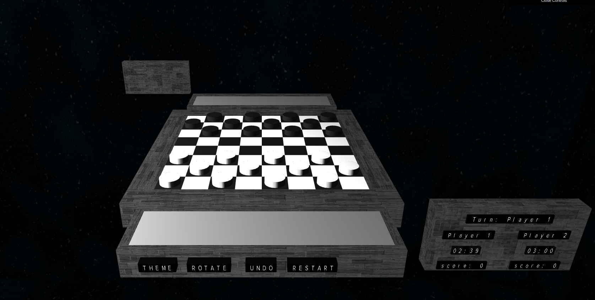
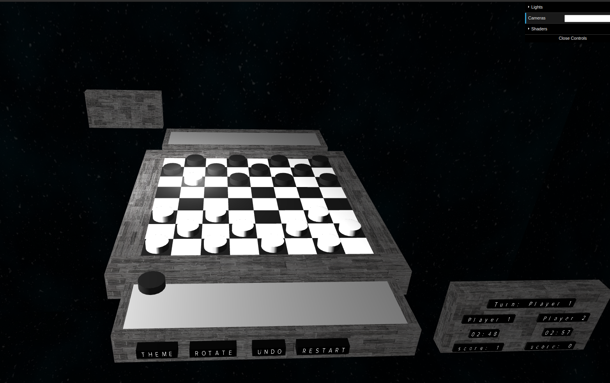
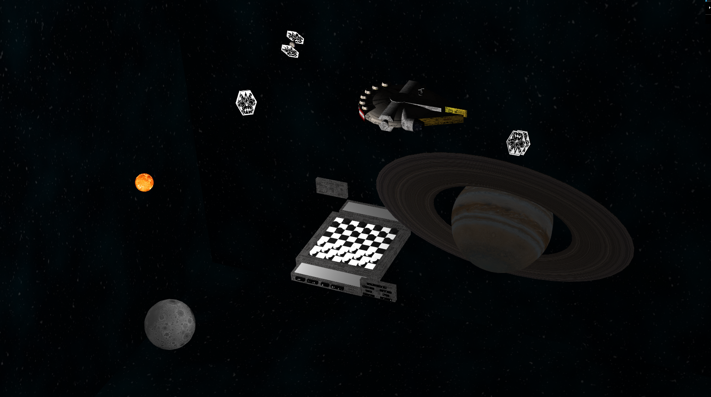

# SGI 2022/2023 - TP3

## Group: T5G09

| Name             | Number    | E-Mail             |
| ---------------- | --------- | ------------------ |
| Sérgio Estêvão         | 201905680 | up201905680@up.pt             |
| Tomás Fidalgo         | 201906743 | up201906743@up.pt               |
----
## Images

| GameBoard           | Gameplay Example     |
| ---------------- | --------- |
|         |  |

| Starwars Scene  |  Tower Scene   |
| ---------------- | --------- |
| | |
## Project information

### Game
- Interactive Chess game
- This game has the following features:
  - Mainboard
  - Auxiliary board where captured pieces are stored
  - Animated piece movement
  - a Spotlight that follows the played piece movement
  - Change the Theme button, which alternates between the two scenes
  - Rotate the camera button, which switches the camera between the player 1 and player 2 perspective
  - Undo button, that goes back to the game stage before the last move
  - Restart button, which restarts the game
  - Next turn button, only visible when there is the option for a piece to make multiple captures, and the piece has already made one, and that forcefully passes the turn to the next player.
  - Personal scoreboard for each player, displaying the status of the game.

### Scene

#### StarWars
- A dynamic positioning of the components paired with relevant camera position produced astounding realistic perspectives
- This scene includes the following:
  - Spaceship chasing scene involving:
    - a Millenium Falcon (with different color schemes, custom headlight);
    - 3 Tie Fighters (with different color headlights);
  - A planet resembling Saturn;
  - A small Star;
  - A Moon;
  - A space background;
  - Nurb surfaces on all rectangles in the scene, Millenium Falcon's parabolic and propulsor air ducts;
  - An animated chasing sequence with:
    - a Millenium Falcon oscillating and firing bullets;
    - a Tie Fighter traveling in a helix trajectory, dodging the bullets;
    - a Tie Fighter traveling in a parabole trajectory;
    - a Tie Fighter performing a parabole trajectory followed by a "barrel roll";
  - Shaders applied on:
    - the small star, simulating a supernova;
    - Millenium Falcon's bullets;
    - Millenium Falcon's cockpit segment;
    - Millenium Falcon's parabolic plate;
    - Milleniun Falcon's parabolica antena point.

- Relative link to the scene: [scenes/SGI_TP2_XML_T5_G09](scenes/SGI_TP2_XML_T5_G09)

#### Tower
- Scene portraying a tall tower close to the stars, having a chess board on the top
- This scene includes the following:
  - a metal Skyscrapper
  - a sun
  - a moon
  - a cube map resembling the stratosphere

----
## Issues/Problems

- Cameras don't work as wanted on the Tower Scene.
